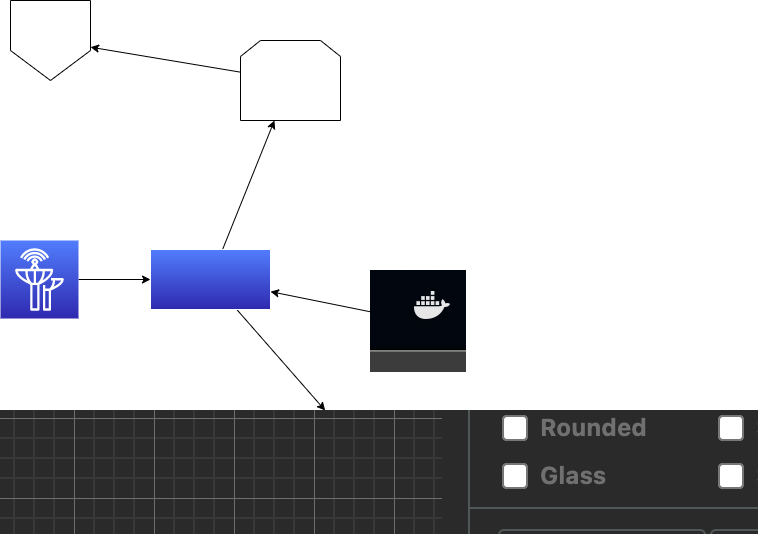

# first-golang

## インストールするツール

## チュートリアル

[https://go.dev/doc/tutorial/getting-started](https://go.dev/doc/tutorial/getting-started)

## 利用するフレームワーク

[https://echo.labstack.com/](https://echo.labstack.com/)

### イメージ１

## めも
https://go.dev/doc/tutorial/add-a-test

### イメージ２

## パッケージをインストール　
go get . 

